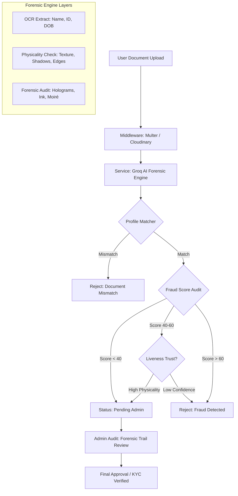

# Technical Specification: AI-First Forensic KYC System

This document provides a deep-dive into the AI-driven Know Your Customer (KYC) architecture implemented for the **Medicine Resale Platform**. This system replaces traditional, easily-spoofable QR code verification with a multi-layered, forensic-grade vision analysis engine.

---

## 🏗️ System Architecture

Our verification pipeline follows a **"Zero-Knowledge, High-Trust"** model. While the AI performs forensic validation, the system enforces **Mandatory Admin Oversight**. No rider is auto-verified; the AI provides the "Forensic Proof," but a human admin must provide the "Final Approval."



---

## 🔍 The Four Pillars of Recognition

### 1. Advanced OCR & Semantic Mapping
Using Large Vision Models (LVM), we perform more than just character recognition. The AI understands the **semantics** of the document.
*   **Field Mapping**: Identifies `fullName`, `idNumber`, and `dob` regardless of document orientation or layout variations.
*   **Case Sensitivity**: Handles regional naming conventions to ensure the `profileMatch` logic is accurate but flexible.

### 2. Physicality & Liveness (Anti-Spoofing)
This is the most critical layer. It prevents **Digital Spoofing** (holding a phone screen to the camera).
*   **3D Depth Perception**: The AI looks for natural light reflections, shadows cast by the card edges, and perspective distortion that only occurs on physical objects.
*   **Texture Recognition**: Analyzes the surface material. Plastic/PVC cards reflect light differently than paper or digital screens.
*   **Rule**: If an image is too "flat" and lacks real-world lighting artifacts, it is flagged as a potential screen capture.

### 3. Forensic Hardware Simulation
The AI simulate the checks traditional hardware (like UV scanners) would perform:
*   **Hologram Verification**: Detects the "rainbow glint" or official government seals.
*   **Signature Forensics**: Analyzes the "fuzziness" of the signature. Genuine pen strokes have a specific bleed pattern on paper; digital overlays are often "too perfect" or pixelated.
*   **Moiré Pattern Detection**: Detects the interference patterns (wavy lines) caused by the camera interacting with a digital display grid.

### 4. Behavioral Profile Matching
Even if the document is real, the identity might be stolen.
*   **Logic**: Every extracted field is cross-referenced with your registered profile.
*   **Security**: A document verified as "Physical Original" will still fail if the `fullName` doesn't semantically match your profile, blocking identity theft attempts.

---

## ⚖️ Forensic Decision Matrix (40/60 Rule)
Our AI does not use a binary PASS/FAIL. It uses a tiered risk model to balance security and accessibility:

1.  **Low Risk (Fraud < 40)**: 
    *   **Action**: Auto-Verification Pass (if profile name matches).
    *   **Scenario**: Clean photo, high confidence in all forensic markers.
2.  **Moderate Risk (Fraud 40-60)**:
    *   **Action (Plastic IDs)**: Pass **ONLY** if `Physicality` is **HIGH** (3D depth required).
    *   **Action (Paper Docs)**: Pass if `Physicality` is **MEDIUM** or above (2D printouts accepted for Insurance/Bank).
    *   **Scenario**: Slightly blurry photo. ID cards must look like plastic. Insurance/Bank papers can look like flat printouts.
3.  **High Risk (Fraud > 60)**:
    *   **Action**: Hard Reject.
    *   **Scenario**: Clear signs of digital manipulation, screen-capture artifacts, or identity theft patterns.

---

## 📊 The Forensic Audit Trail (Reporting)

To ensure full transparency for both mentors and admins, every verification attempt generates a **Forensic Audit Log**. This is stored in the database and accessible via the Admin API.

### Sample Investigative Report:
```json
{
  "riderId": "65cf3a...",
  "verificationStatus": "verified_pending_admin",
  "verificationScores": {
    "aiFraudScore": 12,
    "forensicAudit": [
      "[PAN PASS] Physicality Confidence: MEDIUM. Shadows and edges visible.",
      "[PAN PASS] Signature Integrity: HIGH. Natural ink-bleed detected.",
      "[PAN FAIL] Hologram Confidence: LOW. Obstruction by glare.",
      "[DECISION] Trust-Physicality enabled: Document accepted despite faint hologram."
    ]
  }
}
```

---

## 🛡️ Defeating Fraud: Why this Works
| Fraud Type | Detection Mechanism |
| :--- | :--- |
| **Screen Capture** | Moiré pattern detection & Light Reflection Audit |
| **B&W Photocopy** | Color-depth analysis & Texture check |
| **Identity Theft** | Real-time semantic profile matching |
| **Tampered Data** | Font-integrity & Background consistency checks |

### Conclusion
This project moves beyond "Static Data Entry" to **"Dynamic Document Forensics."** By training the AI to think like a human forensic specialist, we provide a security layer that is robust, scalable, and impossible to bypass with traditional "fake image" techniques.
